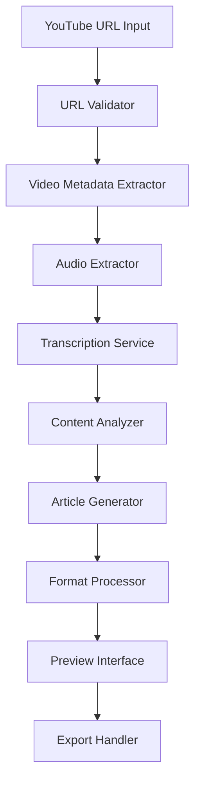

# Vid2Blog Design Document

## Overview

Vid2Blog is a web-based application that transforms YouTube videos into structured blog articles through automated transcription, content analysis, and AI-powered article generation. The system follows a pipeline architecture with distinct stages for video processing, content extraction, and article generation.

## Architecture

The system uses a modular pipeline architecture with the following components:



### Core Processing Pipeline

1. **Input Validation**: Validates YouTube URLs and checks video accessibility
2. **Metadata Extraction**: Retrieves video title, description, duration, and thumbnail
3. **Audio Processing**: Extracts audio stream for transcription
4. **Transcription**: Converts audio to text with timestamps using speech-to-text APIs
5. **Content Analysis**: Identifies topics, key points, and structure using NLP
6. **Article Generation**: Creates formatted blog content using AI language models
7. **Format Processing**: Applies styling, templates, and export formatting
8. **Preview & Export**: Provides editing interface and multiple export options

## Components and Interfaces

### Frontend Components

#### URLInputComponent
- **Purpose**: Handles YouTube URL input and validation
- **Interface**: 
  - Input field with URL validation
  - Submit button with loading states
  - Error display for invalid URLs
- **State Management**: Tracks input value, validation status, and submission state

#### ProcessingStatusComponent  
- **Purpose**: Shows real-time progress through the pipeline stages
- **Interface**:
  - Progress bar with stage indicators
  - Current stage description
  - Estimated time remaining
- **Updates**: Receives progress events via WebSocket or polling

#### ArticlePreviewComponent
- **Purpose**: Displays generated article with editing capabilities
- **Interface**:
  - Rich text editor for content modification
  - Formatting toolbar (headings, bold, italic, lists)
  - Real-time preview pane
- **Features**: Inline editing, auto-save, undo/redo functionality

#### ExportOptionsComponent
- **Purpose**: Handles article export and customization
- **Interface**:
  - Format selection (Markdown, HTML, PDF)
  - Template chooser
  - Download/copy buttons
- **Configuration**: Export settings and template management

### Backend Services

#### VideoProcessingService
- **Responsibilities**:
  - YouTube URL validation and metadata extraction
  - Audio stream extraction using youtube-dl or similar
  - Video accessibility checking
- **APIs**:
  - `validateUrl(url: string): Promise<ValidationResult>`
  - `extractMetadata(url: string): Promise<VideoMetadata>`
  - `extractAudio(url: string): Promise<AudioStream>`

#### TranscriptionService
- **Responsibilities**:
  - Audio-to-text conversion with timestamps
  - Speaker identification for multi-speaker content
  - Confidence scoring for transcription quality
- **APIs**:
  - `transcribe(audio: AudioStream): Promise<Transcript>`
  - `identifySpeakers(transcript: Transcript): Promise<SpeakerSegments>`
- **Integration**: OpenAI Whisper, Google Speech-to-Text, or Azure Speech Services

#### ContentAnalysisService
- **Responsibilities**:
  - Topic identification and content segmentation
  - Key point extraction and summarization
  - Content structure analysis for article organization
- **APIs**:
  - `analyzeContent(transcript: Transcript): Promise<ContentAnalysis>`
  - `extractKeyPoints(content: string): Promise<KeyPoint[]>`
  - `suggestStructure(analysis: ContentAnalysis): Promise<ArticleStructure>`

#### ArticleGenerationService
- **Responsibilities**:
  - Blog article creation from analyzed content
  - Tone and style adaptation based on user preferences
  - SEO optimization and metadata generation
- **APIs**:
  - `generateArticle(analysis: ContentAnalysis, options: GenerationOptions): Promise<Article>`
  - `applyTemplate(article: Article, template: Template): Promise<FormattedArticle>`
- **Integration**: OpenAI GPT, Claude, or other language models

## Data Models

### VideoMetadata
```typescript
interface VideoMetadata {
  id: string;
  title: string;
  description: string;
  duration: number; // seconds
  thumbnailUrl: string;
  channelName: string;
  publishDate: Date;
  viewCount: number;
}
```

### Transcript
```typescript
interface Transcript {
  segments: TranscriptSegment[];
  language: string;
  confidence: number;
  duration: number;
}

interface TranscriptSegment {
  text: string;
  startTime: number;
  endTime: number;
  speaker?: string;
  confidence: number;
}
```

### ContentAnalysis
```typescript
interface ContentAnalysis {
  topics: Topic[];
  keyPoints: KeyPoint[];
  summary: string;
  suggestedStructure: ArticleSection[];
  sentiment: 'positive' | 'neutral' | 'negative';
}

interface Topic {
  name: string;
  relevance: number;
  timeRanges: TimeRange[];
}

interface KeyPoint {
  text: string;
  importance: number;
  timestamp: number;
  category: string;
}
```

### Article
```typescript
interface Article {
  title: string;
  introduction: string;
  sections: ArticleSection[];
  conclusion: string;
  metadata: ArticleMetadata;
  tags: string[];
}

interface ArticleSection {
  heading: string;
  content: string;
  subsections?: ArticleSection[];
}

interface ArticleMetadata {
  wordCount: number;
  readingTime: number;
  seoTitle: string;
  metaDescription: string;
  sourceVideo: VideoMetadata;
}
```

## Error Handling

### Input Validation Errors
- Invalid YouTube URL format
- Private or unavailable videos
- Age-restricted content requiring authentication
- Videos exceeding maximum duration limits

### Processing Errors
- Audio extraction failures due to copyright restrictions
- Transcription service timeouts or API limits
- Poor audio quality resulting in low confidence transcripts
- Content analysis failures for non-speech content

### System Errors
- Service unavailability and fallback mechanisms
- Rate limiting and queue management
- Storage and memory constraints for large videos
- Network connectivity issues during processing

### Error Recovery Strategies
- Retry mechanisms with exponential backoff
- Graceful degradation for partial failures
- User notification with actionable error messages
- Manual intervention options for complex cases

## Testing Strategy

### Unit Testing
- Individual service method testing with mocked dependencies
- Data model validation and transformation testing
- Error handling and edge case coverage
- Performance testing for large video processing

### Integration Testing
- End-to-end pipeline testing with sample YouTube videos
- API integration testing with external services
- Database operations and data persistence testing
- Cross-browser compatibility for frontend components

### User Acceptance Testing
- Real-world video processing with various content types
- User interface usability and accessibility testing
- Performance testing with concurrent users
- Export format validation and quality assessment

### Performance Testing
- Load testing with multiple simultaneous video processing requests
- Memory usage monitoring during large video processing
- API response time measurement and optimization
- Scalability testing for increased user volume

## Security Considerations

### Input Sanitization
- YouTube URL validation to prevent injection attacks
- Content filtering for inappropriate or harmful material
- Rate limiting to prevent abuse and resource exhaustion

### Data Privacy
- Temporary storage of audio and transcript data
- Automatic cleanup of processed content after export
- User consent for content processing and storage
- Compliance with data protection regulations

### API Security
- Authentication and authorization for service access
- API key management for external service integrations
- Secure communication protocols (HTTPS/TLS)
- Input validation and output sanitization